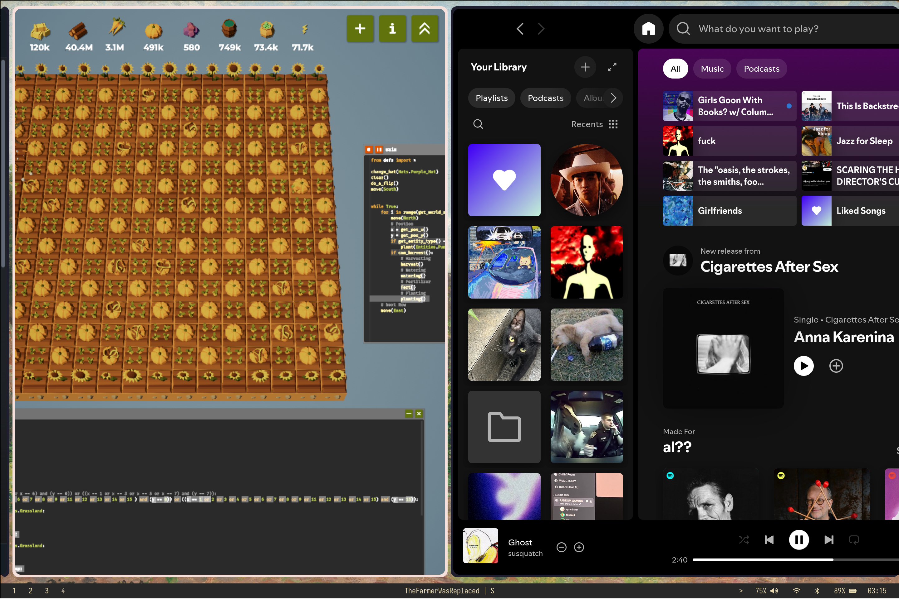
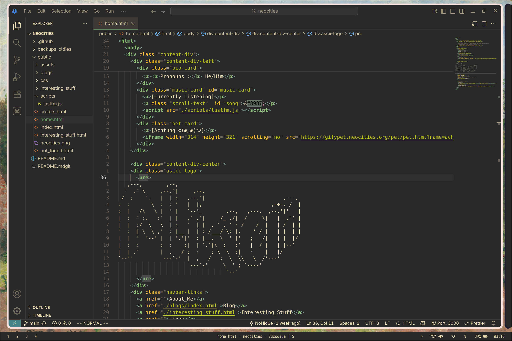
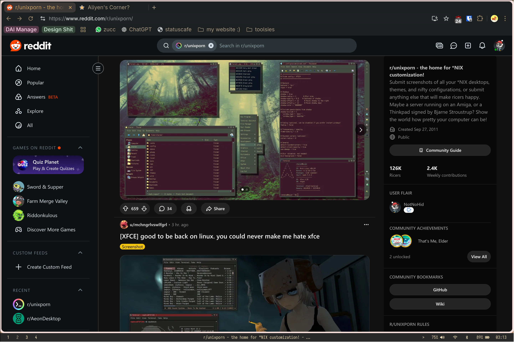

# Kittybox ( ͡° ᴥ ͡°)
i was bored and kinda drunk so i made this in a day enjoy while it last or until i got bored and reset my laptop again ~~or when i switch to mac~~
- terminal : foot
- browser : helium browser ([Gruvbox Slate Theme](https://chromewebstore.google.com/detail/gruvbox-slate/giokfhncgfjkoamdbhfhfhgpikaioccc))
- game : the farmer was replaced
- code editor : vscodium (material gruvbox theme)
- colorscheme : gruvbox
- font : zed mono

btw this dotfiles focus on a laptop setup
### Screenshots

# IT BROKE
for some reason (that is beyond my knowledge) neovim broke ( ͡° ʖ̯ ͡°) so yeah dont copy that shit lmfao
